<div align="center">

# hyprland_configs

**A complete Hyprland desktop with 33 interchangeable rices.**

Switching a rice swaps the terminal, bar, launcher, notifications, lock screen,
editor colours, prompt and wallpaper *together* — and can change what the
desktop **is**, not just how it's painted. Some profiles run waybar, some a
dock, some conky, some yambar, some nothing at all.

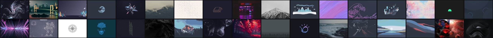

`33 rices` · `4 light` · `7 launcher styles` · `7 shell layouts` · `wallpapers included`

**[Every rice, with descriptions and palettes →](#the-rices)**

<sub>There's also <a href="RICES.html"><code>RICES.html</code></a> — the same
overview as a filterable page. GitHub shows it as source, so open it in a
browser after cloning: <code>xdg-open RICES.html</code></sub>

</div>

---

## Contents

- [Quick start](#quick-start)
- [Requirements](#requirements)
- [Setup, step by step](#setup-step-by-step)
- [Did it work?](#did-it-work)
- [Everyday use](#everyday-use)
- [The rices](#the-rices)
- [How the theme system works](#how-the-theme-system-works)
- [Make your own rice](#make-your-own-rice)
- [Troubleshooting](#troubleshooting)
- [Running on a different machine](#running-on-a-different-machine)
- [Repo layout](#repo-layout)

---

## Quick start

On a working Arch + Hyprland system:

```bash
git clone https://github.com/marcid34/hyprland_configs.git ~/.config/rices/hyprland_configs
cd ~/.config/rices/hyprland_configs
./install.sh
```

Then pick a rice and log back in:

```bash
themes/switch.sh dracula
```

That's the whole thing. The installer backs up anything it replaces, installs
missing packages for you, and fixes up absolute paths automatically.

> **Where you clone it matters.** The installer replaces `~/.config/hypr`,
> `~/.config/waybar`, `~/.config/rofi` and friends with symlinks into this
> repo. If the repo itself lives *inside* one of those directories, it moves
> itself out from under the installer mid-run and everything after that fails.
> Clone it to `~/.config/rices/…` (as above), `~/repos/…`, or anywhere else
> that isn't a config directory it manages.

---

## Requirements

- **Arch Linux or an Arch derivative.** The installer drives `pacman`, and uses
  `yay` or `paru` for the handful of AUR packages if you have one.
- **Hyprland**, already running. This repo configures Hyprland; it doesn't
  install a display stack for you.
- **A Nerd Font.** The bars and terminal use glyph icons. Without one you get
  tofu boxes instead of icons.

You do **not** need to install packages by hand — `./install.sh` detects what's
missing per component and offers to install it. The lists below are only here
so you know what you're agreeing to.

<details>
<summary><b>Everything from the official repos</b></summary>

```bash
sudo pacman -S --needed \
  hyprland hypridle hyprlock hyprpaper \
  waybar mako rofi alacritty fastfetch cava btop neovim \
  wofi fuzzel nwg-panel nwg-drawer nwg-dock-hyprland conky starship \
  grim slurp swappy wl-clipboard brightnessctl playerctl wireplumber \
  thunar python jq curl git fontconfig \
  ttf-jetbrains-mono-nerd ttf-ubuntu-mono-nerd ttf-nerd-fonts-symbols \
  ttf-ubuntu-font-family adwaita-fonts gnu-free-fonts terminus-font
```

</details>

<details>
<summary><b>AUR packages (every one degrades gracefully)</b></summary>

```bash
yay -S swww yambar tofi bibata-cursor-theme-bin
```

| Package | Used by | If missing |
| --- | --- | --- |
| `swww` | animated wallpaper transitions | falls back to `hyprpaper` (instant swap) |
| `yambar` | the `oxocarbon` rice's bar | that rice runs with no bar |
| `tofi` | 5 rices' launcher | those rices fall back to `rofi` |
| `bibata-cursor-theme-bin` | the session-wide cursor set in `hypr/hyprland.lua` | you silently get the system default cursor |

</details>

<details>
<summary><b>What "full functionality" actually means here</b></summary>

`./install.sh` checks for all of it and offers to install what's missing, so
you shouldn't need the lists above. Three separate kinds of dependency get
checked, because they can't be detected the same way:

| Kind | Checked with | Why it matters |
| --- | --- | --- |
| commands | `command -v` | a missing launcher or bar means that rice falls back |
| fonts | `fc-list`, exact family match | a substituted font changes a rice's whole character; a missing Nerd Font turns every bar icon into tofu |
| cursor themes | an icon dir with `cursors/` in it | `hyprctl setcursor` reports success for a theme that doesn't exist and leaves you with no cursor |

Rices that build their own cursors (`calamity`) have them generated during
install, into `~/.local/share/icons` — no root, no extra step.

</details>

---

## Setup, step by step

**1. Clone it somewhere that isn't a managed config directory.**

```bash
git clone https://github.com/marcid34/hyprland_configs.git ~/.config/rices/hyprland_configs
cd ~/.config/rices/hyprland_configs
```

**2. Look before you leap (optional but recommended).**

```bash
./install.sh --dry-run
```

Prints every file it would back up, replace or rewrite, and changes nothing.

**3. Install.**

```bash
./install.sh
```

It prompts before each replacement. To accept everything without prompts:

```bash
./install.sh -y
```

What it does, in order:

1. Installs `themes/` first, creating `~/.config/themes/current` — the single
   symlink every other component styles itself through.
2. For each component, checks its packages and offers to install any missing
   ones (`--no-deps` skips this).
3. Backs up anything it's about to replace to `<path>.bak.<timestamp>`.
4. Symlinks the repo's directories into `~/.config`.
5. Rewrites the few absolute paths that can't express `$HOME` portably, and
   tells you which files it touched.

**4. Pick a rice.**

```bash
themes/switch.sh dracula     # apply one by name
themes/switch.sh --next      # or just cycle through them
```

All 33 names are listed in [The rices](#the-rices) below, and in
`themes/profiles.list`. Once you're logged in, `Super + T` opens a picker.

**5. Log out and back into Hyprland.**

Needed once, so the compositor picks up `hypr/hyprland.lua`. Everything else —
bar, launcher, notifications, wallpaper — applies live from then on.

### Installing only some of it

Every component stands alone:

```bash
./install.sh --list           # component names
./install.sh hypr waybar      # just these two
./hypr/install.sh             # equivalently, directly
```

It's idempotent — re-running on an installed system reports "already linked"
and moves on.

---

## Did it work?

```bash
themes/switch.sh --current    # prints the active rice
```

- **Bar, wallpaper and colours all changed together** → you're done.
- **`Super + T`** should open a rice picker.
- **`Super + R`** should open a launcher.

If a rice looks half-applied, `switch.sh` refuses to apply an incomplete
profile and says which file is missing, so check its output first.

---

## Everyday use

`Super` is the modifier. Full list in `hypr/hyprland.lua`.

| Key | Does |
| --- | --- |
| `Super + T` | **rice picker** |
| `Super + R` / `E` | launcher / file manager |
| `Super + Q` / `C` | terminal / close window |
| `Super + L` | lock |
| `Super + I` | status HUD (works even on rices with no bar) |
| `Super + F` | fullscreen |
| `Super + V` | float toggle |
| `Super + Shift + S` | region screenshot → swappy |
| `Print` | full screenshot → file + clipboard |
| `Super + N` | dismiss notification (`Shift` toggles do-not-disturb) |
| `Super + 1..0` | workspace (`Shift` moves window there) |
| `Super + S` | special workspace |

From a shell:

```bash
themes/switch.sh <rice>     # apply
themes/switch.sh --next     # cycle
themes/switch.sh --current  # what's active
```

---

## The rices

Every wallpaper is included in this repo under `wallpapers/<rice>/`.
The colour strip under each preview is that rice's actual declared palette.

### Signature <sub>(1)</sub>

The one this repo was built around.

<table>
<tr><td width="33%" valign="top">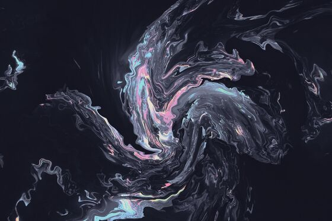<br>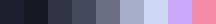<br><b>kib-custom</b> · <code>kib-custom</code><br><sub>Catppuccin Mocha — matched to alacritty + nvim rice</sub><br><sub><b>shell</b> waybar · <b>launcher</b> rofi</sub></td><td width="33%"></td><td width="33%"></td></tr>
</table>
### Switchable <sub>(1)</sub>

One shape, more than one palette, swapped live from a control the rice puts on the desktop itself.

<table>
<tr><td width="33%" valign="top">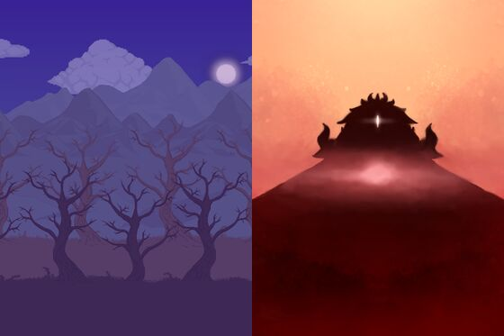<br><br><b>calamity</b> · <code>calamity</code><br><sub>Terraria, by way of the Calamity mod. Two biomes in one rice — Corruption's shadow-purple and cursed-flame green, or Crimson's crimtane red and ichor gold — swapped live from a button in the bar, which repaints every app and the wallpaper with it.</sub><br><sub><b>shell</b> waybar · <b>launcher</b> rofi</sub></td><td width="33%"></td><td width="33%"></td></tr>
</table>
### Designed atmospheres <sub>(9)</sub>

The layout changes here, not just the colours — different bar shape, different launcher, different amount of chrome.

<table>
<tr><td width="33%" valign="top">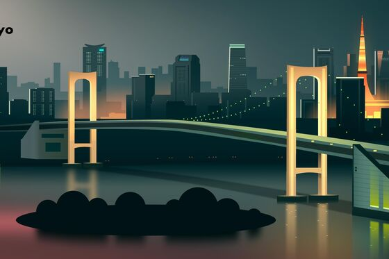<br>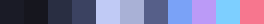<br><b>tokyo night</b> · <code>tokyonight</code><br><sub>Neon dusk. Deep navy glass pills with a faint inner highlight, and the accent colours carry a soft glow rather than a solid fill — the palette's blues are luminous enough that glow reads better than block colour.</sub><br><sub><b>shell</b> waybar · <b>launcher</b> rofi-grid</sub></td><td width="33%" valign="top">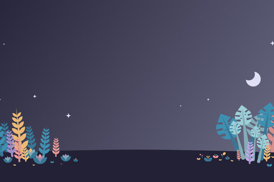<br>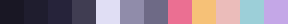<br><b>rose pine</b> · <code>rosepine</code><br><sub>Soho at dusk. No hard borders anywhere: modules are defined by a barely lighter surface fill and a lot of breathing room.</sub><br><sub><b>shell</b> waybar, nwg-dock · <b>launcher</b> wofi</sub></td><td width="33%" valign="top">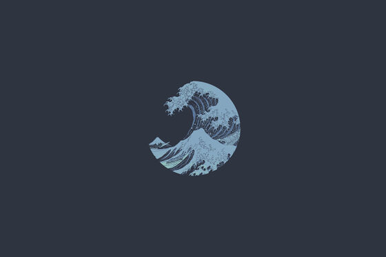<br>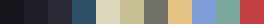<br><b>kanagawa</b> · <code>kanagawa</code><br><sub>Ink wash. A solid sumi-black bar rather than floating islands: the modules sit on one continuous surface separated by wave-blue rules, like columns of text on a woodblock print.</sub><br><sub><b>shell</b> waybar · <b>launcher</b> rofi</sub></td></tr>
<tr><td width="33%" valign="top">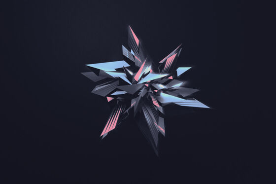<br>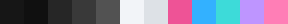<br><b>oxocarbon</b> · <code>oxocarbon</code><br><sub>IBM Carbon. Zero radius, precise 2px rules, near-black ground and one electric magenta.</sub><br><sub><b>shell</b> yambar · <b>launcher</b> rofi-full</sub></td><td width="33%" valign="top"><br>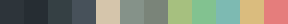<br><b>everforest</b> · <code>everforest</code><br><sub>Soft forest. Rounded, muted, deliberately low-contrast — this palette is designed to be easy on the eyes for long sessions, so nothing here glows, inverts or shouts.</sub><br><sub><b>shell</b> waybar, conky · <b>launcher</b> wofi</sub></td><td width="33%" valign="top">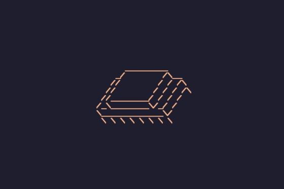<br>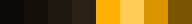<br><b>amber crt</b> · <code>amber</code><br><sub>Single-phosphor CRT. The discipline that makes this read as *designed* rather than dated is that there is exactly one hue: #ffb000, varied only in brightness.</sub><br><sub><b>shell</b> conky · <b>launcher</b> tofi</sub></td></tr>
<tr><td width="33%" valign="top">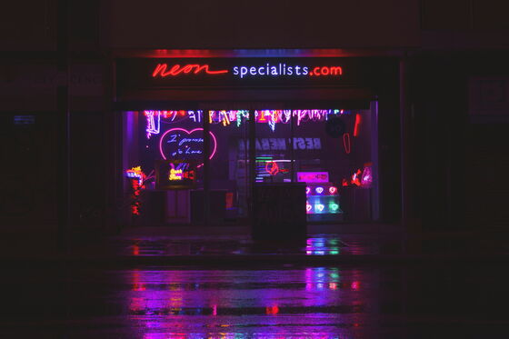<br>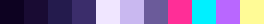<br><b>outrun</b> · <code>outrun</code><br><sub>1984 neon. Indigo night, hot magenta, cyan horizon.</sub><br><sub><b>shell</b> waybar · <b>launcher</b> rofi-full</sub></td><td width="33%" valign="top"><br><br><b>mono</b> · <code>mono</code><br><sub>Swiss. There is no colour in this rice — not one hue, anywhere.</sub><br><sub><b>shell</b> none · <b>launcher</b> fuzzel</sub></td><td width="33%" valign="top">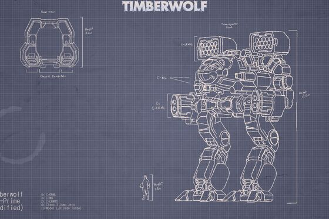<br>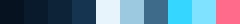<br><b>blueprint</b> · <code>blueprint</code><br><sub>Blueprint — drafting table. Cyan hairlines on navy, all monospace.</sub><br><sub><b>shell</b> waybar, conky · <b>launcher</b> tofi</sub></td></tr>
</table>
### Palette classics <sub>(9)</sub>

Faithful takes on palettes you already know, applied across every app.

<table>
<tr><td width="33%" valign="top">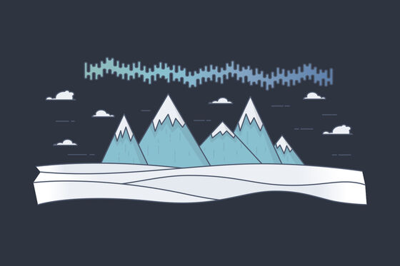<br><br><b>nord</b> · <code>nord</code><br><sub>Nord — arctic. Cool blue-greys, frost cyan, zero warmth.</sub><br><sub><b>shell</b> waybar · <b>launcher</b> drawer</sub></td><td width="33%" valign="top">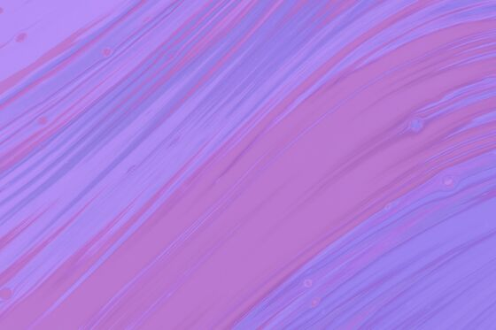<br><br><b>dracula</b> · <code>dracula</code><br><sub>Dracula — the classic. Violet, magenta and cyan on graphite.</sub><br><sub><b>shell</b> waybar · <b>launcher</b> rofi-grid</sub></td><td width="33%" valign="top">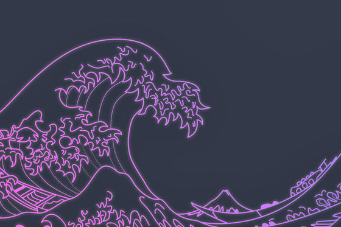<br><br><b>duskfox</b> · <code>duskfox</code><br><sub>Duskfox — muted violet night. Rose Pine's cousin, cooler and dimmer.</sub><br><sub><b>shell</b> waybar · <b>launcher</b> rofi</sub></td></tr>
<tr><td width="33%" valign="top">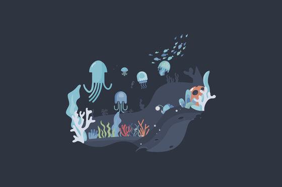<br><br><b>abyss</b> · <code>abyss</code><br><sub>Abyss — deep water. Near-black navy, teal and electric cyan.</sub><br><sub><b>shell</b> waybar · <b>launcher</b> rofi-grid</sub></td><td width="33%" valign="top">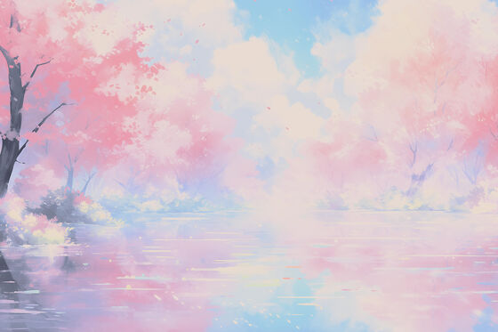<br>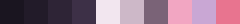<br><b>sakura</b> · <code>sakura</code><br><sub>Sakura — blossom at night. Soft pink and lilac on plum-black.</sub><br><sub><b>shell</b> waybar · <b>launcher</b> fuzzel</sub></td><td width="33%" valign="top">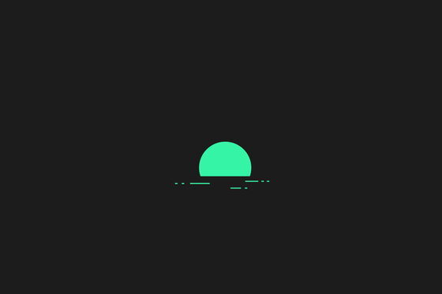<br>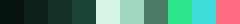<br><b>emerald</b> · <code>emerald</code><br><sub>Emerald — deep green glass. Jewel tones on near-black forest.</sub><br><sub><b>shell</b> waybar · <b>launcher</b> tofi</sub></td></tr>
<tr><td width="33%" valign="top">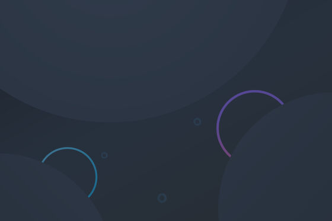<br>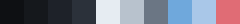<br><b>mercury</b> · <code>mercury</code><br><sub>Mercury — cool silver. Near-monochrome, one ice-blue accent.</sub><br><sub><b>shell</b> waybar · <b>launcher</b> fuzzel</sub></td><td width="33%" valign="top">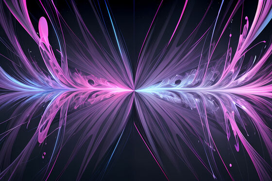<br>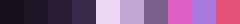<br><b>plum</b> · <code>plum</code><br><sub>Plum — aubergine and magenta. Rich, saturated, unapologetic.</sub><br><sub><b>shell</b> waybar · <b>launcher</b> rofi-full</sub></td><td width="33%" valign="top">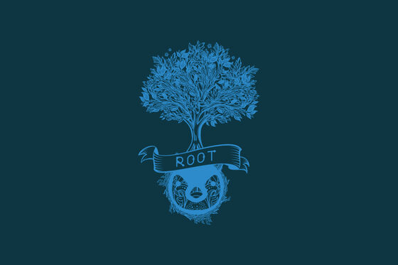<br><br><b>solarized</b> · <code>solarized</code><br><sub>Solarized Dark — the 2011 classic. Teal base, restrained accents.</sub><br><sub><b>shell</b> nwg-panel · <b>launcher</b> wofi</sub></td></tr>
</table>
### Deep &amp; moody <sub>(7)</sub>

Low light, high restraint. Built for a dark room and an OLED panel.

<table>
<tr><td width="33%" valign="top">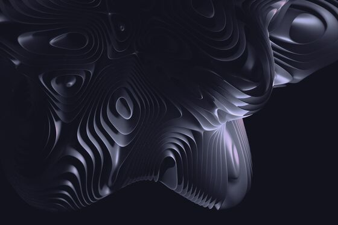<br><br><b>obsidian</b> · <code>obsidian</code><br><sub>Obsidian — true black with a single violet. Built for OLED.</sub><br><sub><b>shell</b> waybar · <b>launcher</b> rofi-grid</sub></td><td width="33%" valign="top">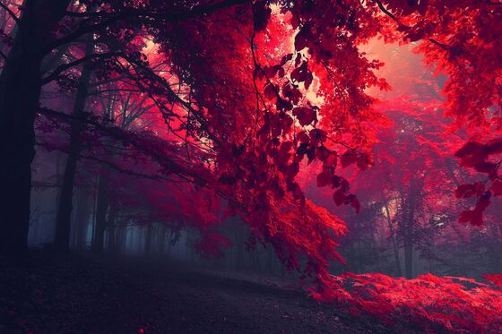<br><br><b>crimson</b> · <code>crimson</code><br><sub>Crimson — burgundy and oxblood. Warm dark, no brightness anywhere.</sub><br><sub><b>shell</b> waybar · <b>launcher</b> drawer</sub></td><td width="33%" valign="top">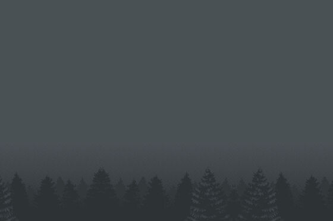<br>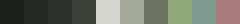<br><b>moss</b> · <code>moss</code><br><sub>Moss — desaturated sage and stone. The quietest palette here.</sub><br><sub><b>shell</b> waybar · <b>launcher</b> rofi</sub></td></tr>
<tr><td width="33%" valign="top">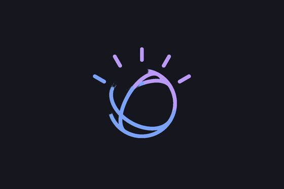<br>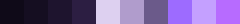<br><b>ultraviolet</b> · <code>ultraviolet</code><br><sub>Ultraviolet — monochrome violet. One hue, twelve values, nothing else.</sub><br><sub><b>shell</b> waybar · <b>launcher</b> rofi-grid</sub></td><td width="33%" valign="top">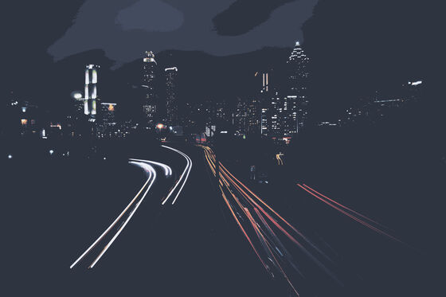<br>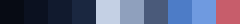<br><b>midnight</b> · <code>midnight</code><br><sub>Midnight — deepest navy. Almost no chrome; status on demand only.</sub><br><sub><b>shell</b> none · <b>launcher</b> tofi</sub></td><td width="33%" valign="top">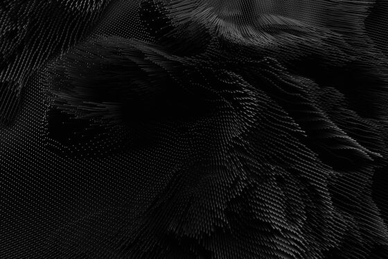<br><br><b>noir</b> · <code>noir</code><br><sub>Noir — film stock. Hard greyscale, one crimson accent, deep shadows.</sub><br><sub><b>shell</b> waybar · <b>launcher</b> rofi-full</sub></td></tr>
<tr><td width="33%" valign="top">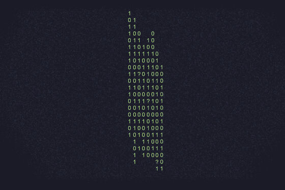<br><br><b>matrix</b> · <code>matrix</code><br><sub>Matrix — code rain. Pure green on black, no chrome at all.</sub><br><sub><b>shell</b> conky · <b>launcher</b> tofi</sub></td><td width="33%"></td><td width="33%"></td></tr>
</table>
### Light <sub>(4)</sub>

Genuinely light, not a dark theme turned up. Readable in daylight.

<table>
<tr><td width="33%" valign="top">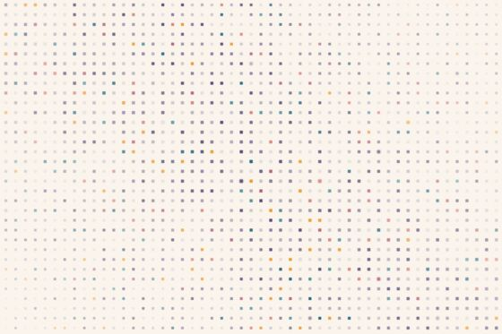<br>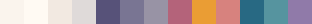<br><b>dawn</b> · <code>dawn</code><br><sub>The light rice. Warm paper ground, ink-violet text, and depth carried by soft shadows instead of borders — on a light surface a 1px outline reads as grubby, while a diffuse shadow reads as lift.</sub><br><sub><b>shell</b> waybar, nwg-dock · <b>launcher</b> drawer</sub></td><td width="33%" valign="top">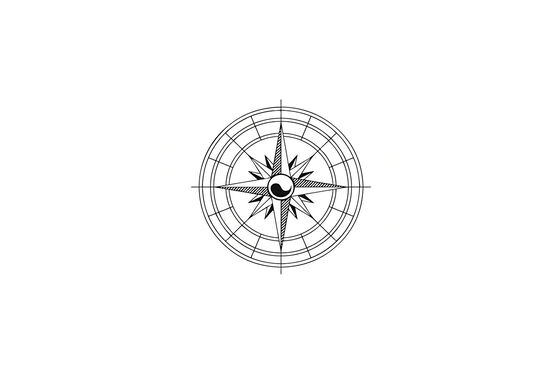<br>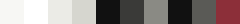<br><b>e-ink</b> · <code>eink</code><br><sub>E-ink — paper. Pure black on warm white, no colour, no gloss.</sub><br><sub><b>shell</b> none · <b>launcher</b> fuzzel</sub></td><td width="33%" valign="top">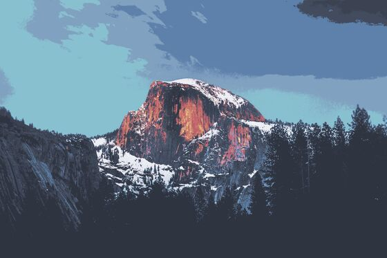<br>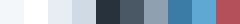<br><b>arctic</b> · <code>arctic</code><br><sub>Arctic — a LIGHT rice. Ice white, pale blue, cold and clean.</sub><br><sub><b>shell</b> waybar · <b>launcher</b> fuzzel</sub></td></tr>
<tr><td width="33%" valign="top"><br><br><b>porcelain</b> · <code>porcelain</code><br><sub>Porcelain — a LIGHT clinical rice. Cool white, blue-grey, surgical.</sub><br><sub><b>shell</b> waybar · <b>launcher</b> fuzzel</sub></td><td width="33%"></td><td width="33%"></td></tr>
</table>
### Desktop homage <sub>(2)</sub>

Deliberate impersonations, down to the bar geometry and dock behaviour.

<table>
<tr><td width="33%" valign="top">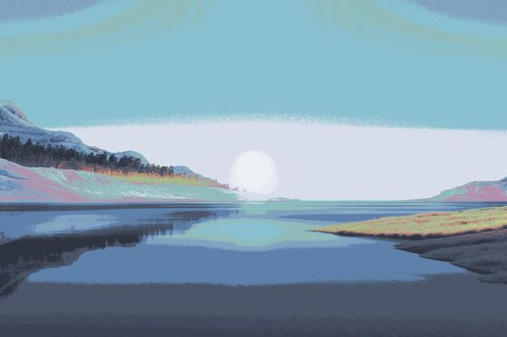<br><br><b>Windows 11 Pro</b> · <code>win11</code><br><sub>Mica: a near-opaque dark surface, 4px-rounded hover fills, centred icon cluster, and the clock stacked time-over-date hard against the right.</sub><br><sub><b>shell</b> waybar · <b>launcher</b> rofi-grid</sub></td><td width="33%" valign="top">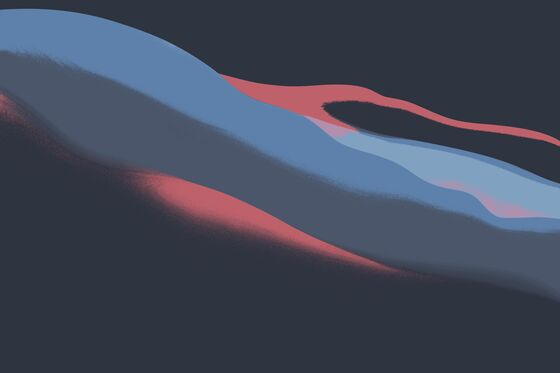<br><br><b>Mac OS X</b> · <code>macos</code><br><sub>26px, heavily translucent, no rounding (it is flush to the top edge), SF-ish type at 13px, and generous spacing between status items. The dock is nwg-dock, not waybar.</sub><br><sub><b>shell</b> waybar, nwg-dock · <b>launcher</b> rofi-grid</sub></td><td width="33%"></td></tr>
</table>


---

## How the theme system works

One symlink drives everything:

```
~/.config/themes/current  ->  ~/.config/themes/<rice>
```

Apps reach their styling through it in one of two ways:

| Consumer | Mechanism |
| --- | --- |
| `waybar`, `mako`, `fastfetch`, `hyprlock`, `starship` | the live config path *is* a symlink into `themes/current/` |
| `rofi`, `alacritty`, `hypr`, `nvim` | the real config `@import`s / `dofile()`s out of `themes/current/` |

So a switch is: repoint one symlink, then poke each app to reload.
`themes/switch.sh` does that, and refuses to apply a rice missing any of its
required files rather than half-applying one.

Because the config directories are symlinks into this repo, editing
`~/.config/waybar/style.css` **is** editing this repo. There's no copy to keep
in sync.

---

## Make your own rice

A rice is a directory of small files:

```
themes/<rice>/
  alacritty.toml   hypr.lua        hyprlock.conf   mako.conf
  nvim.lua         rofi.rasi       waybar.jsonc    waybar.css
  fastfetch.jsonc
  shell.components   which desktop components this rice runs
  wallpaper          image path(s) + transition
  launcher           which launcher layout to use
```

To add one:

```bash
cp -r themes/dracula themes/mytheme
mkdir -p wallpapers/mytheme && cp ~/some.jpg wallpapers/mytheme/
$EDITOR themes/mytheme/wallpaper          # point it at that file (absolute path)
$EDITOR themes/profiles.list              # add:  mytheme|my theme|●|○
themes/switch.sh mytheme
```

`profiles.list` is `<dirname>|<label>|<active-glyph>|<idle-glyph>`, and its
order is the left-to-right order of the waybar profile indicators.

Optional per-rice extras: `btop.theme`, `cava.conf`, `starship.toml`,
`rofi-grid.rasi`, `rofi-full.rasi`, `wofi.conf`, `wofi.css`, `fuzzel.ini`,
`tofi.conf`, `drawer.css`, `nwg-panel.json`, plus:

| File | Does |
| --- | --- |
| `about` | one line describing the rice, used by the docs instead of guessing from a header comment |
| `cursor` | `<xcursor-theme> [size]`, applied on switch — skipped with a warning if that theme isn't installed |

### Rices with more than one mode

`calamity` is the worked example. It has one shape and two palettes, and puts
a button in its own bar to swap between them:

```
themes/calamity/
  modes/corruption/   the colour-carrying files: waybar.css, rofi.rasi,
  modes/crimson/      alacritty.toml, hyprlock.conf, mako.conf, hypr.lua,
                      nvim.lua, fastfetch.jsonc, btop.theme, cava.conf,
                      wallpaper, cursor
  modes/current  ->   corruption          the only thing a switch changes
  waybar.css     ->   modes/current/waybar.css     (and the same for the rest)
  waybar.jsonc        shared: layout doesn't change between modes
  mode.sh             the switcher
```

Because the rice-root files are symlinks through `modes/current`, flipping that
one link repoints all twelve at once; `mode.sh` then re-applies the rice so
every app reloads. It's the same trick `themes/current` uses, one level down.

```bash
themes/calamity/mode.sh              # which biome is live
themes/calamity/mode.sh --toggle     # switch to the other
themes/calamity/mode.sh crimson      # switch to a named one
```

The bar button calls `mode.sh --toggle` through `setsid -f`, because
re-applying the rice restarts waybar — a plain `on-click` would run as
waybar's child and kill itself partway through the switch.

---

## Troubleshooting

<details>
<summary><b><code>Super + R</code> opens an empty launcher, or nothing happens</b></summary>

Your rice declares a launcher you don't have installed, and the rofi fallback
is being used. Install the launchers (`sudo pacman -S wofi fuzzel`,
`yay -S tofi`), or edit `themes/<rice>/launcher` to say `rofi`.

</details>

<details>
<summary><b>Icons show as empty boxes</b></summary>

No Nerd Font installed. `sudo pacman -S ttf-jetbrains-mono-nerd ttf-nerd-fonts-symbols`,
then `fc-cache -fv` and restart the bar (`themes/shell.sh restart`).

</details>

<details>
<summary><b>Wallpaper doesn't change</b></summary>

`switch.sh` skips a wallpaper whose file doesn't exist and applies the rest of
the rice. Check the path in `themes/<rice>/wallpaper` resolves — it must be
absolute; `~` and `$HOME` are not expanded there.

</details>

<details>
<summary><b>The installer says it's rewriting paths in dozens of files</b></summary>

Expected, once. A few configs carry a real absolute home path because they
can't express `$HOME` portably. The installer rewrites them to yours and lists
what it touched. It shows up as a normal `git diff` — commit it on your fork,
or `git checkout` those paths before sending a PR upstream.

</details>

<details>
<summary><b>I cloned into <code>~/.config/hypr/</code> and the install exploded</b></summary>

That directory is one the installer replaces with a symlink, so the repo got
moved out from under it. Move the clone somewhere neutral
(`~/.config/rices/hyprland_configs`), restore anything from the `.bak.*`
backups you need, and re-run.

</details>

---

## Running on a different machine

**Monitors.** `hypr/hyprland.lua` pins outputs to explicit coordinates —
deliberately, because `auto` ordering flips when the dGPU is primary. On other
hardware, edit those `hl.monitor{}` blocks or replace them with:

```lua
hl.monitor({ output = ',preferred,auto,1' })
```

**Absolute paths.** `alacritty`'s `working_directory` (alacritty expands
neither `~` nor `$HOME` there), each rice's `hyprlock.conf`, and each rice's
`wallpaper` carry real paths. The installer detects the origin home directory
from the tree and rewrites it to yours automatically — no configuration needed.

**Fonts.** A Nerd Font is assumed throughout.

---

## Repo layout

```
install.sh              orchestrator — ordering and summary only
lib/common.sh           shared machinery (deps, backup, link, path rewrite)
<component>/install.sh  declarative: which packages, which paths
themes/<rice>/          one directory per rice
themes/switch.sh        applies a rice
themes/picker.sh        the Super+T menu
themes/profiles.list    the registry, and the bar's indicator order
wallpapers/<rice>/      wallpapers, one folder per rice
docs/                   thumbnails and palette strips for this README
RICES.html              browsable overview of every rice
```

### What isn't tracked

**Generated state**, listed in `.gitignore`: the `themes/current` symlink, the
per-app theme symlinks, and `hypr/hyprpaper.conf` — which `switch.sh` rewrites
from `hyprctl monitors` on every change, so it reflects whatever displays were
plugged in at the time.

**nwg-panel's icon sets**, which ship with the package.

---

<div align="center">
<sub>Wallpapers are collected from public sources and are the property of their
respective authors — see <a href="wallpapers/CREDITS.md">wallpapers/CREDITS.md</a>.</sub>
</div>
